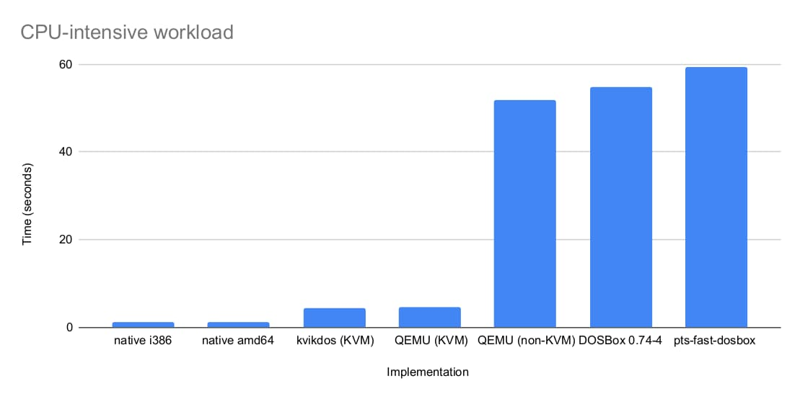
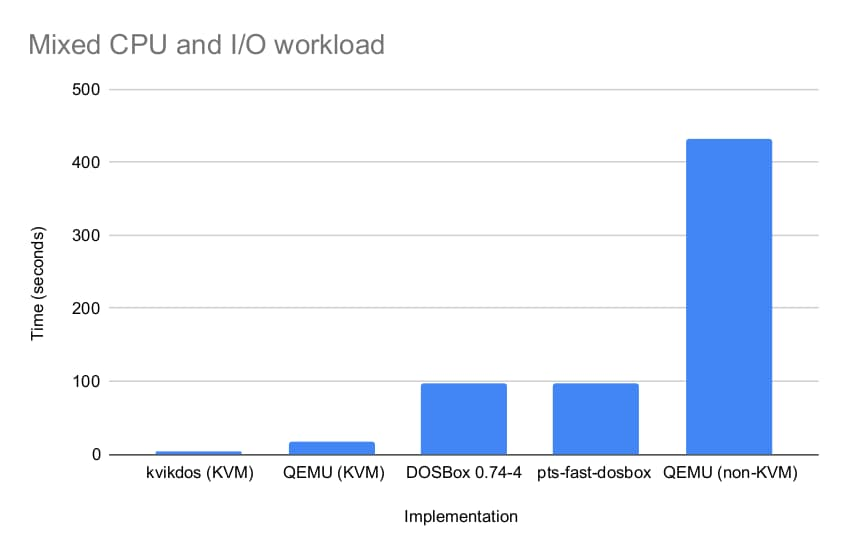

# DOS emulator benchmark

Smaller values indicate faster execution, thus they are better.

## CPU-intensive workload

* native i386: 1.1260s
* native amd64: 1.1320s
* kvikdos (KVM-based): 4.457s
* qemu -enable-kvm + MS-DOS 6.22 + EIDL: 4.5061s
* qemu (non-KVM) + MS-DOS 6.22 + EIDL: 51.765s  
* DOSBox 0.74-4: 54.863s
* pts-fast-dosbox: 59.447s

The benchmark code was running a busy no-op loop, and it printed a dot after a few million iterations.

EIDL prevents a 100% CPU busy delay loop in MS-DOS within QEMU.

## Mixed CPU and I/O workload

* kvikdos (KVM-based): 3.6699s
* qemu -enable-kvm + MS-DOS 6.22 + EIDL: 16.5406s
* DOSBox 0.74-4: 96.71538s
* pts-fast-dosbox: 97.5397s
* qemu (non-KVM) + MS-DOS 6.22 + EIDL: 431.9221s

The benchmark code was compiling a 98 KiB BASIC source file to a 121 KiB OMF .obj file. The compilation was rerun 154 times, times added.
